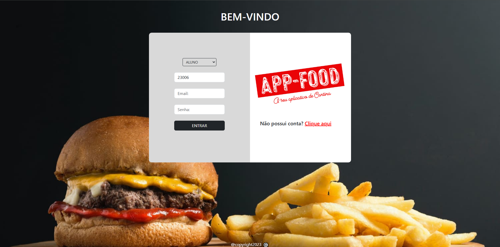
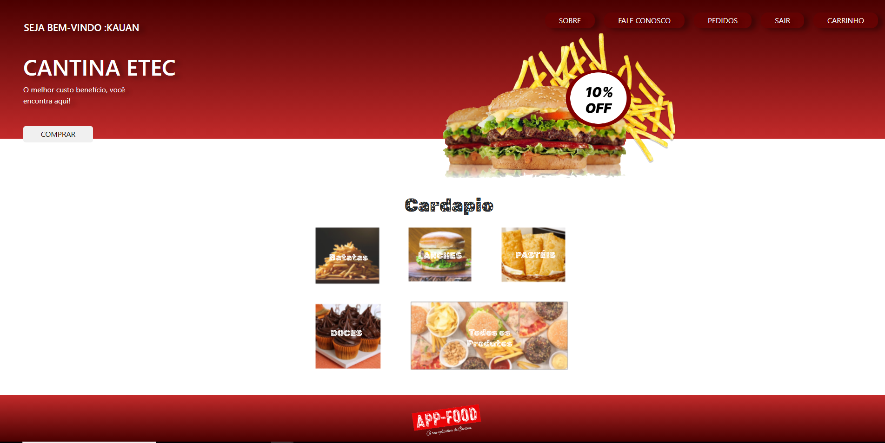
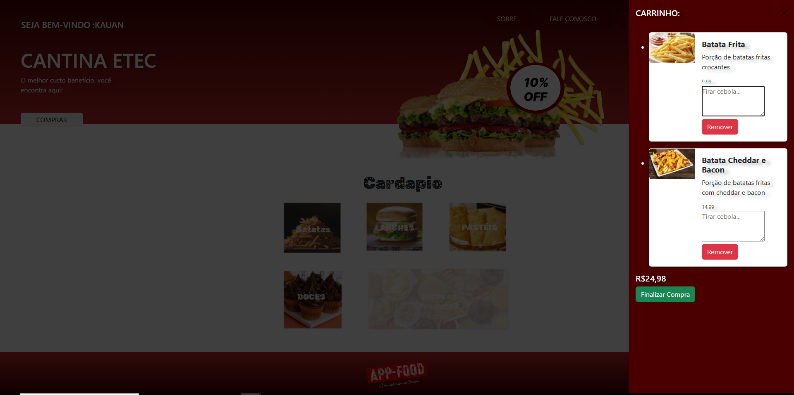
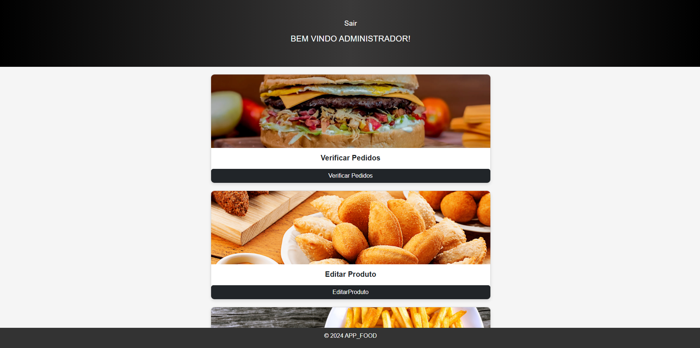
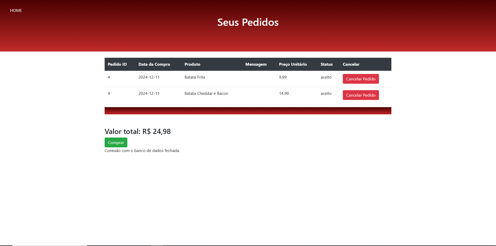

# APP-Food - Sistema de Pedidos Online

**APP-Food** é um sistema web desenvolvido para permitir que os clientes façam pedidos online de alimentos, com uma interface intuitiva e moderna. O projeto foi desenvolvido como Trabalho de Conclusão de Curso (TCC) da ETEC, e oferece funcionalidades completas tanto para os usuários finais quanto para os administradores do sistema.

Com integração com o **Mercado Pago** para pagamentos online, CRUD de produtos e a possibilidade de o administrador aceitar ou recusar pedidos, o APP-Food é uma solução completa para a gestão de pedidos em restaurantes e estabelecimentos alimentícios.

  <!-- Substitua com o caminho correto da imagem -->

## 💡 Funcionalidades

- **Cadastro e Login de Usuários**: Sistema de autenticação para clientes e administradores.
- **Carrinho de Compras**: Permite adicionar, remover e visualizar itens no carrinho antes de finalizar o pedido.
- **Integração com Mercado Pago**: Processamento seguro de pagamentos diretamente no site.
- **CRUD de Produtos**: Admin pode adicionar, editar e excluir produtos do cardápio.
- **Gestão de Pedidos**: O administrador pode visualizar todos os pedidos e definir se aceita ou recusa os pedidos feitos pelos clientes.
- **Interface Responsiva**: O sistema é responsivo, funcionando bem em dispositivos móveis e desktops.

## 🚀 Tecnologias Utilizadas

O APP-Food foi desenvolvido utilizando as seguintes tecnologias:

- **Frontend**:
  - HTML
  - CSS
  - JavaScript

- **Backend**:
  - PHP
  - Express.js
  - MYSQL
  - Mercado Pago API (para pagamento)

## ⚙️ Principais Funcionalidades

### 1. **Cadastro e Login de Usuários**
O cliente pode criar uma conta, fazer login e gerenciar seus pedidos através da plataforma.

### 2. **Carrinho de Compras**
Os clientes podem adicionar e remover produtos do carrinho, visualizar o resumo do pedido e realizar o pagamento de maneira fácil e segura.

### 3. **Integração com Mercado Pago**
O sistema está integrado ao Mercado Pago, permitindo que os usuários paguem pelos seus pedidos de forma rápida e segura.

### 4. **CRUD de Produtos (Admin)**
O administrador pode adicionar, editar ou excluir produtos do cardápio, gerenciando o catálogo de maneira simples.

### 5. **Gestão de Pedidos (Admin)**
O administrador pode visualizar todos os pedidos realizados, com a opção de aceitá-los ou recusá-los. O status do pedido é atualizado de acordo com a ação do administrador.

## 📸 Capturas de Tela

Aqui estão algumas capturas de tela do projeto em funcionamento:

  <!-- Substitua com o caminho correto da imagem -->

  <!-- Substitua com o caminho correto da imagem -->

  <!-- Substitua com o caminho correto da imagem -->

  <!-- Substitua com o caminho correto da imagem -->

## 🎉 Melhorias Futuras
### 1. **Melhorar estruturação de arquivos**
### 2. **Responsividade total**
### 3. **Melhorar Segurança do sistema**
### 4. **Refatoração de códgios**

